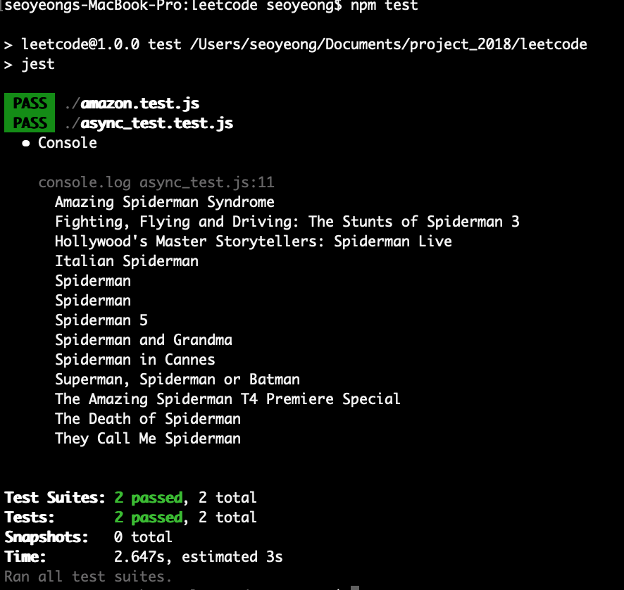

# async_and_jest
learn how to test async function with jest

I've been rewriting code for my personal project and also write test case for it too. 
But when I encountered code like one written below , i believed i need to change the way i use promise


```javascript
function getMovieTitles(substr) {
    
    getData(substr)
        .then((data) => data.map(getTitle))
        .then((data) => data.sort())
        .then((data) => data.join('\n'))
        .then((data) => printResultOnScreen(data))
        .catch((error) => console.log("error " + error));
}
    
function getData(textInput, result = [], page = 1){
    const requestUrl = 'https://jsonmock.hackerrank.com/api/movies/search/?Title=' + textInput + '&page=' + page;
    let data = '';
    return new Promise((resolve, reject) => {
        https.get(requestUrl, (response) => {

            response.on('data', (partialData) => {
                data += partialData;
            });
            response.on('end', ()=> {
            parsedData = JSON.parse(data);
            Array.prototype.push.apply(result, parsedData.data);
            if(shouldCallAgain(parsedData)) {
                
                getData(textInput, result, (page + 1)).then(resolve).catch(reject);
            } else {
                resolve(result);
            }
            })
        }).on("error", reject);
    });
}

function getTitle(data){
    return data.Title;
};

function shouldCallAgain(response){
    return response.page < response.total_pages;
}


```

To make function return testable return value, I used async-await

```javascript
const https = require('https');

async function getData(textInput){
   let response =  await getMovieData(textInput).catch((error) => console.log("error " + error));
   let result = response.map(getTitle).sort().join('\n');
   return result;
}

function getMovieData(textInput, result = [], page =1){

    const requestUrl = 'https://jsonmock.hackerrank.com/api/movies/search/?Title=' + textInput + '&page=' + page;
    return new Promise((resolve, reject) => {
        let data = '';
        https.get(requestUrl, (response) => {
                response.on('data', (partialData) => {
                    data += partialData;
                });
                response.on('end', ()=> {
                parsedData = JSON.parse(data);
                result.push(...parsedData.data);
                if(shouldCallAgain(parsedData)) {
                   getMovieData(textInput, result, (page + 1)).then(resolve).catch(reject);
                } else {
                    resolve(result);
                }
                })
            }).on("error", reject);
        })
}
function shouldCallAgain(response){
    return response.page < response.total_pages;
}

module.exports = getData;

```


With value returned form getData function, I was able to run test like below :

```javascript
const getData = require('./async_test');

const result = 
`Amazing Spiderman Syndrome
Fighting, Flying and Driving: The Stunts of Spiderman 3
Hollywood's Master Storytellers: Spiderman Live
Italian Spiderman
Spiderman
Spiderman
Spiderman 5
Spiderman and Grandma
Spiderman in Cannes
Superman, Spiderman or Batman
The Amazing Spiderman T4 Premiere Special
The Death of Spiderman
They Call Me Spiderman`;
const inputText = 'Spiderman';


test('Async function test', async() => {   
      expect.asser
      let response = await getData(inputText);
      expect(response).toEqual(result);
});  
```



